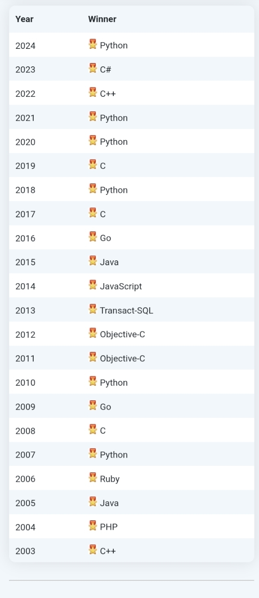

# Day 1 - 2 — Pengenalan Python

Tags: Journey
author: Bulan Nurlaela
Last Update: June 7, 2025 10:46 PM

# 📌 Topik Hari Ini

Note: Langsung lihat ringkasan saya

## **Apa itu bahasa pemrograman Python?**

- Python adalah bahasa pemrograman **tingkat tinggi** (high level  programming: bahasa yang lebih dekat dengan bahasa manusia daripada bahasa mesin) yang mudah dipelajari karena sintaksnya (aturan penulisan kode) mirip bahasa manusia.
- Python merupakan salah satu *general purpose programming language* (bahasa pemrograman yang digunakan untuk membangun perangkat lunak dalam ragam domain aplikasi), sehingga dapat digunakan untuk berbagai keperluan dan bidang, seperti IoT, Artificial Intelligence, Data Science/Analyst, Automation hingga Web Development sekaligus.
- Karena kedua hal itu, Python jadi salah satu bahasa pemrograman yang paling di minati dan populer.
    
    
    
    

## **Keunggulan Python**

- Mudah dibaca dan ditulis
- Punya banyak **library** (kumpulan fungsi siap pakai) untuk analisis data seperti NumPy, Pandas, Matplotlib
- Komunitas dan dukungan yang besar

*“Python was created in the early 1990s by Guido van Rossum at Stichting Mathematisch Centrum (CWI, see [https://www.cwi.nl](https://www.cwi.nl/)) in the Netherlands as a successor of a language called ABC. Guido remains Python’s principal author, although it includes many contributions from others.*

*In 1995, Guido continued his work on Python at the Corporation for National Research Initiatives (CNRI, see [https://www.cnri.reston.va.us](https://www.cnri.reston.va.us/)) in Reston, Virginia where he released several versions of the software.”*

— docs. Website resmi Python

<aside>
❗

Install dan Setup Python 3 dapat dilihat di website resminya /downloads

</aside>

Contoh kode sederhana:

```python
print("Halo Dunia!")  # Ini mencetak teks
```

Penjelasan:

- `print()` adalah fungsi untuk menampilkan karakter atau kalimat, harus di sertai penggunaan tanda kutip (`””`)
    - `"Halo Dunia!"` adalah teks (disebut **string**).
    - `#` adalah komentar (tidak dieksekusi).

## **Variabel**

dalam Python, variabel seperti kotak penyimpanan, yakni wadah/tempat untuk menyimpan data atau informasi.

Contoh penggunaan:

```python
nama = "Andi"      # Variabel 'nama' menyimpan teks "Andi" (tipe data string)
umur = 25          # Variabel 'umur' menyimpan angka bulat (integer)
tinggi = 170.5     # Variabel 'tinggi' menyimpan angka desimal (float)
is_student = True  # Variabel 'is_student' menyimpan nilai boolean (True/False)
```

Tanda `=` pada kode di atas **bukan berarti sama**, tetapi menyimpan nilai di sebelah kanan dengan nama variabel (nama, umur, tinggi, is_student) di sebelah kiri. Operator ini `=` biasanya disebut *assignment operator*.

Contoh penggunaan yang salah:

```python
2nama = "Budi"  # Error (awal angka)
nama-mahasiswa = "Andi"  # Error (pakai tanda minus)
```

Aturan penamaan variabel:

| **Do**                          | **Contoh**                          | **Don't**                          | **Contoh Salah**                     | **Keterangan** |
|----------------------------------|-------------------------------------|------------------------------------|--------------------------------------|----------------|
| **Boleh mengandung huruf, angka (tidak di awal), atau underscore (`_`)** | `nama = "Budi"`<br>`_umur = 20`<br>`nama_1 = "Alya"`<br>`umur2 = 23` | **Jangan pakai spasi/tab** | `nama lengkap = "Budi"` | ❌ Error: Spasi tidak diperbolehkan |
| **Case-sensitive (huruf besar/kecil berpengaruh)** | `Nama = "Andi"`<br>`nama = "Budi"`<br><br>`print(Nama)` → Output: `"Andi"`<br>`print(nama)` → Output: `"Budi"` | **Jangan pakai simbol khusus (kecuali `_`)** | `nama@ = "Budi"`<br>`nilai-ujian = 90`<br>`harga$ = 5000` | ❌ Error: Simbol seperti `@`, `-`, `$` tidak valid |
| **Gunakan nama yang deskriptif** | `jumlah_barang = 10`<br>`total_harga = 50000` | **Jangan pakai keyword Python** | `if = 10`<br>`def = "test"` | ❌ Error: `if`, `def`, dll. adalah reserved words Python

**Best practice**:

- Gunakan `snake_case` (**huruf kecil di pisah underscore**) untuk variabel biasa
    
    ```python
    nama_mahasiswa = "Andi"  
    nilai_ujian = 90  
    ```
    
- Gunakan `CamelCase` (**huruf pertama kapital, tanpa karakter khusus**) untuk nama kelas (class)
    
    ```python
    class MahasiswaBaru:  
        pass  
    ```
    
- Gunakan `UPPER_CASE` untuk konstanta (nilai yang tidak berubah)
    
    ```python
    PI = 3.14  
    MAX_USER = 100  
    ```
    
- Hindari nama variabel yang tidak jelas
    
    ```python
    x = 10      # ❌ Kurang deskriptif  
    umur = 10   # ✅ Lebih jelas  
    ```
    

## **Tipe data dasar**

adalah klasifikasi yang menentukan jenis nilai yang dapat disimpan dalam variabel.

| Tipe Data | Contoh | Penjelasan |
| --- | --- | --- |
| `int` (integer) | `10`, `-5`, `0` | Bilangan bulat (tidak ada koma) |
| `float` | `3.14`, `-0.5` | Bilangan desimal (ada koma) |
| `str` (string) | `"Hello"`, `'123'` | Teks (harus diapit tanda kutip) |
| `bool` (boolean) | `True`, `False` | Hanya dua nilai: Benar (`True`)/Salah (`False`) |
| `list` | `[1, 2, 3]` | Kumpulan data yang bisa diubah (**mutable**) |
| `tuple` | `(1, 2, 3)` | Kumpulan data yang tidak bisa diubah (**immutable**) |
| `dict` (dictionary) | `{"nama": "Budi", "umur": 20}` | Data berpasangan (**key-value pair**) |

Cek tipe data dengan `type()`:

```python
print(type(10))       # Output: <class 'int'>  (artinya tipe datanya integer)
print(type(3.14))     # Output: <class 'float'>
print(type("Hello"))  # Output: <class 'str'>
```

## Operator

Operator adalah simbol khusus yang digunakan untuk melakukan operasi pada variabel dan nilai.

- **Operator aritmatika**
    
    Untuk perhitungan matematika dasar.
    
    | Operator | Contoh | Hasil | Keterangan |
    | --- | --- | --- | --- |
    | `+` | `5 + 3` | `8` | Penjumlahan |
    | `-` | `10 - 4` | `6` | Pengurangan |
    | `*` | `3 * 7` | `21` | Perkalian |
    | `/` | `10 / 2` | `5.0` | Pembagian (hasilnya **float**) |
    | `//` | `10 // 3` | `3` | Pembagian bulat (**floor division**) |
    | `%` | `10 % 3` | `1` | Modulus (sisa hasil bagi) |
    | `**` | `2 ** 3` | `8` | Pangkat (**exponentiation**) |
    
    Contoh penggunaan:
    
    ```python
    harga = 15000
    jumlah = 3
    total = harga * jumlah  # Perkalian untuk menghitung total
    print(total)  # Output: 45000
    ```
    

- **Operator Perbandingan**
    
    Membandingkan antara dua nilai yang hasilnya `true`/`false`.
    
    | Operator | Arti | Contoh | Hasil |
    | --- | --- | --- | --- |
    | `==` | Sama dengan | `5 == 5` | `True` |
    | `!=` | Tidak sama | `5 != 3` | `True` |
    | `>` | Lebih besar | `10 > 5` | `True` |
    | `<` | Lebih kecil | `10 < 5` | `False` |
    | `>=` | Lebih besar/sama | `10 >= 10` | `True` |
    | `<=` | Lebih kecil/sama | `5 <= 3` | `False` |

- **Operator Penugasan (Assignment)**
Untuk memberi nilai ke variabel
    - Operator penugasan dasar (`=`)
        - Digunakan untuk memberikan nilai awal ke variabel.
            
            ```python
            x = 10  # Variabel x diberi nilai 10
            nama = "Budi"  # Variabel nama diberi string "Budi"
            ```
            
    - Operator penugasan gabungan
        
        Menggabungkan operasi matematika dengan 
        
    
    | Operator | Contoh | Sama Dengan |
    | --- | --- | --- |
    | `=` | `a = 5` | `a = 5` |
    | `+=` | `a += 3` | `a = a + 3` |
    | `-=` | `a -= 2` | `a = a - 2` |
    | `*=` | `a *= 4` | `a = a * 4` |
    | `/=` | `a /= 2` | `a = a / 2` |
    | `%=` | `a %= 3` | `a = a % 3` |
    
    Contoh:
    
    ```python
    x = 10
    x += 5  # x sekarang 15
    # cara kerjanya:
    print(x)
    ```
    
 - **Operator Logika**
    Digunakan untuk menggabungkan kondisi:
    
    | Operator | Contoh | Penjelasan |
    | --- | --- | --- |
    | `and` | `a and b` | True jika kedua kondisi benar |
    | `or` | `a or b` | True jika salah satu kondisi benar |
    | `not` | `not a` | Membalik nilai boolean (True jadi False) |
    
    Contoh:
    
    ```python
    print(True and False)  # False
    print(True or False)   # True
    print(not True)        # False
    
    ```
    
- **Operator Keanggotaan (Membership)** 
  Untuk mengecek apakah nilai ada dalam sequence:
        
    
    | Operator | Contoh | Penjelasan |
    | --- | --- | --- |
    | `in` | `x in y` | True jika x ada di y |
    | `not in` | `x not in y` | True jika x tidak ada di y |
    
    **Contoh:**
    
    ```python
    buah = ["apel", "jeruk", "mangga"]
    print("apel" in buah)     # True
    print("anggur" not in buah) # True
    
    ```
    
- **Operator Identitas (Identity)**
  Mengecek apakah dua objek sama (di memory):
        
    
    | Operator | Contoh | Penjelasan |
    | --- | --- | --- |
    | `is` | `a is b` | True jika objek sama |
    | `is not` | `a is not b` | True jika objek berbeda |
    
    **Contoh:**
    
    ```python
    x = [1, 2, 3]
    y = x
    z = [1, 2, 3]
    
    print(x is y)     # True (referensi sama)
    print(x is z)     # False (objek berbeda)
    
    ```
    
- **Operator Bitwise**      
  Untuk operasi biner (jarang dipakai pemula):
        
    
    | Operator | Contoh | Penjelasan |
    | --- | --- | --- |
    | `&` | `a & b` | AND bitwise |
    | `\|` | `a \| b` | OR bitwise |
    | `^` | `a ^ b` | XOR bitwise |
    | `~` | `~a` | NOT bitwise |
    | `<<` | `a << b` | Geser kiri bit |
    | `>>` | `a >> b` | Geser kanan bit |
    
    **Contoh:**
    
    ```python
    print(5 & 3)  # 1 (0101 AND 0011 = 0001)
    
    ```
    

## 📘 Ringkasan

Atau yang benar-benar ada di kepala saya saat itu juga— atau kata kunci yang dapat merangsang otak saya, terserah Anda bagaimana melihatnya:

- Python
    - *High programming language* → mirip manusia
    - *General purpose progamming language* → umum digunakan di mana saja. Like general?
    - 1982
- Variabel
    - Wadah dalam programming untuk menyimpan sesuatu, apapun itu.
    - Aturan pembuatannya:
        - Huruf boleh, angka boleh tapi jangan di awal, ya?
        - Semua karakter khusus (termasuk spasi dan tab) big no, kecuali underscore
        - *Case*-nya *sensitif* jadi harus hati-hati kalau tidak ya ngambek alias error
        - Jangan ada Python keyword di antara kita! Aku gak mau di duakan!— kalau variabel bisa ngomong~ ceritanya sih begitu
        - Variabel banyak maunya, ini kira-kira yang maunya dia kalau kita menyatakan sesuatu sebagai dia:
            - `snake_case` buat variaebel biasa. Like `aku_baper` = “Mang eakkk?”
            - `CamelCase` buat nama kelas. Like `AkuBaperMas` = “Agar silaturahmi tidak terputus ….”
            - `UPPER_CASE` buat konstanta (tunggal, tetap). Like `API_KEY` = 123*******
            - Intinya jangan tijel ya kawan-kawan!
- Tipe data
    - “String”
    - Integer → bilangan bulat
    - Float → desimal
    - Boolean → Hanya ada satu kebenaran, blablabla aku adalah detektif Conan! → `true` atau `false`, bang?
    - `[”l”, “i”, “s”, “t”]` → mutable
    - `(”T”, “u”, “p”, “l”, “e”)` → immutable
    - `{”Dict” : “tionary”}` → couple, `key` dan `value`
- Operator
    - Aritmatika → Untuk perhitungan (`+`, `-`, `*`, `/`, dll)
    - Perbandingan → Hasil `True`/`False` (`==`, `>`, `<`, dll)
    - Penugasan → Memberi nilai ke variabel(`=`, `+=`, `-=`, dll)
    - Logika → Gabungkan kondisi (`and`, `or`, `not`)
    - Keanggotaan → Cek nilai dalam list (`in`, `not in`)
    - Identitas → Cek objek (`is`, `is not`)
    - Bitwise → Operasi biner (jarang dipakai pemula)

## 🔧 Tools Digunakan

- Python
- Notion
- Chrome

## 📈 Progress

- Aktivitas: Melihat dokumentasi, mencatat dan mengulang pembelajaran
- Latihan atau Mini Proyek: [Google Colab](https://colab.research.google.com/drive/1bvmb2DhfNTi9eY9FM_V1pkZD__UakeEM)

## 📎 Resource

- [Website Resmi Python](https://www.python.org)
- [Skilvul - Python Dasar](https://skilvul.com/courses/python-dasar) (Course, free)
- [Tiobe Index](https://www.tiobe.com/tiobe-index/)

## 🗣️ Refleksi

- Walau saya sudah mempelajarinya di kursus yang saya ikuti, itu hilang dari kepala saya karena kurangnya metode belajar yang efektif dan tidak mencatat secara aktif
- Saya benar-benar berusaha (tertawa dengan nada gitar)
- Mulai terasa bagaimana perbedaan jika saya benar-benar mencatat apa yang saya pikirkan terkait materi ini, alih-alih hanya membaca atau menghafal materi yang berkeliaran di internet
